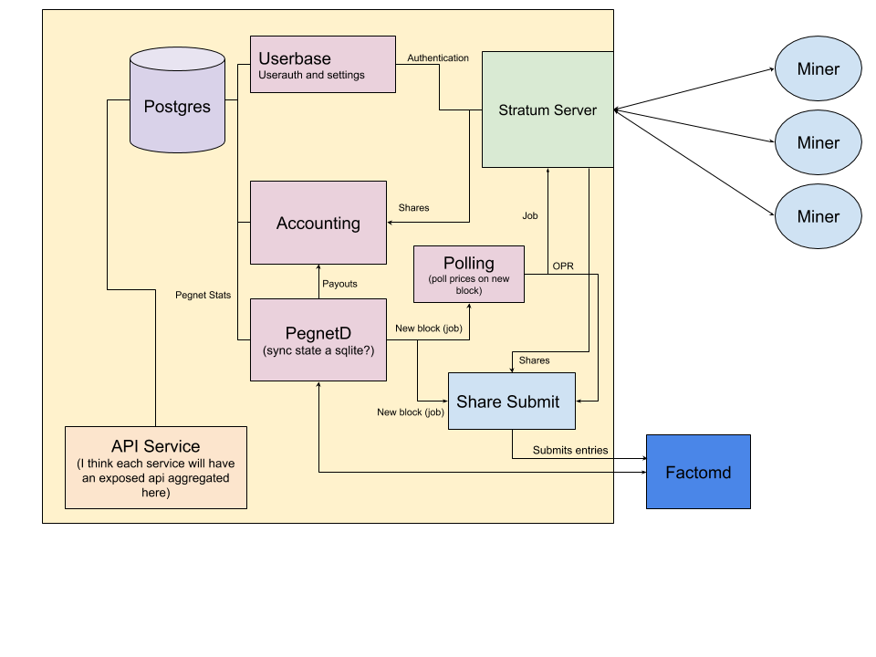

# Prosper Pool

### Pegnet Repository Of Stratum Pool Extensions and RPCs

Prosper is a mining pool implementation for PegNet and works with `prosper-miner`. The pool handles polling datasources and syncing the pegnet chain to come up with the oprhash for miners to mine. When a miner submits their work to the pool in the form of a share, the pool software determines whether or not to submit that share, and will credit the miner for the work they have done.

# Design

There are a few moving parts in the pool. This diagram depicts things from a high-level:



More details about the initial design can be found [here](Prosper Pegnet Mining Pool.pdf). The document may not track the development changes.

## Notes

### The pool cannot bootstrap the network

The pool is currently not able to bootstrap the network. If running local development, it is advised to also run a local pegnet miner to ensure enough records are submitted. The pool requires a fully valid (25 winners) block to start mining ontop of.

### Rolling Submissions

The pegnet reference miner requires a node that syncs with minutes. If the minute syncing is lost, the miner is dead in the water. Prosper pool does not require syncing by minutes, and uses a rolling submission strategy. If your hashpower begins to dominate the network, tweaking might be necessary. A 36 block (6 hr) exponential moving average is kept of the network difficulty to determine whether or not to submit a share.

#### SoftMaxLimit

The issue with rolling submissions, is that is possible to submit over 50 records, which is a complete waste of ECs. If you dominate the network hashpower, or following a hashrate decrease (like a network pause), this is problematic. The pool implements what we are calling a "SoftMaxLimit". Instead of saying the pool can **only** submit 50 records, the pool says it has a soft limt of 25. 

How it works is the pool saves the best 25 shares for any given job. If a new share is under the 25th share, it blocks it from being submitted. If it is above the 25th, it submits is and resorts the list. This helps when you start submitting over 200+ records. In a brief simulation, if you would submit 139 entries, this feature still lets through 105. If you submit 450, it let through 160. And at 1941, it let through 247. This feature helps fight any exponential hashpower difference. A tighter method is much more complicated to implement, so this should be superseded or supplemented by something else in the future.

### Payouts

What we owe miners is recorded, but no payouts actually occur. This is to be implemented at a future date.

### Stopping the pool

All miner work is stored in memory and saved to postgres at the start of the next block. If the pool is shut down, the miner work for that block is lost and the pool will receive the full payout.

### Stratum RPCs

The RPC documentation, including the PegNet-oriented modifications and additions, can be found [here](stratum_adj.md). To run the Stratum server only (for experimentation and/or debugging purposes) you can run things with the `stratum` command included: `prosper-pool stratum` and then run a client/miner to connect with it normally (the server will disable strict authentication requirements in this state). This also enables a simControl-esque environment, where server-side commands like `listclients`, `getversion <client-id>`, or `showmessage <client-id> <message>` or client-side commands like `getopr <job-id>` can be entered directly by the user.


# Development environment

GoLang v1.13+ must be used when compiling the pool. A docker compose is provided to run postgres.

If you are running the pool against a private network and not mainnet, you must ensure:
 - The pegnet chains are initialized
 - There are valid pegnet blocks being made (like by the reference miner)
 
When running the pool, the additional flag `--testing` **must** be provided. The mainnet activation heights are embedded in the codebase, and the `--testing` flag will set these activation heights to 0 and allow your node to start syncing pegnet from block height 0. 


## Postgres instance

```
echo "launch the postgres db"
docker-compose up -d db
```

## User Authentication

https://github.com/qor/auth is used for user management and authentication. All user registration must be done through a miner and the stratum server.


# Usage

To interact with a running pool as an admin, you can consult [this document](./ADMIN.md)

## Docker instructions
First, make sure that `factomd` is running locally (or get the address of a remotely running instance). Also, double-check the values in the `docker-compose.yml` file are appropriate for your setup:

* Update the `"http://172.17.0.1:8088/v2"` flag passed to `--fhost` to match the location of the `factomd` instance you are connecting to.
* If you would like to change the `LXRBITSIZE` value to something lower (for quicker deployments during testing), you can do so in `docker-compose.yml`.

Then you can start a postgres database and the prosper server binary with:

```
docker-compose up
```
*Note: you can pass the `-d` flag to `docker-compose` if you'd like to run this detached)*

The configuration for the pool server is by default stored and managed at `~/.prosper/prosper-pool.toml` though this can be changed with the `--config` command-line option. Please look and modify your config before running the pool. The `prosper-pool datasources` command will help you setup your data sources.

Once the server is running, you can [run and connect a prosper-miner to it](prosper-miner/README.md).


## Command-line options

You can use `prosper-pool --help` to list the command-line arguments and options. There are hidden commands used for development purposes.

```
Launch the private pool

Usage:
  prosper-pool [flags]
  prosper-pool [command]

Available Commands:
  config      Write a example config with defaults
  datasources Reads a config and outputs the data sources and their priorities
  db          Any direct db interactions can be done through this cli.
  help        Help about any command

Flags:
      --act int         Enable a custom activation height for testing mode
      --config string   Location to config (default "$HOME/.prosper/prosper-pool.toml")
      --fhost string    Factomd host url (default "http://localhost:8088/v2")
  -h, --help            help for prosper-pool
      --log string      Change the logging level. Can choose from 'trace', 'debug', 'info', 'warn', 'error', or 'fatal' (default "info")
      --phost string    Postgres host url (default "192.168.32.2")
      --pport int       Postgres host port (default 5432)
      --rauth           Enable miners to use actual registered usernames (default true)
      --sport int       Stratum server host port (default 1234)
      --testing         Enable testing mode

Use "prosper-pool [command] --help" for more information about a command.
```
